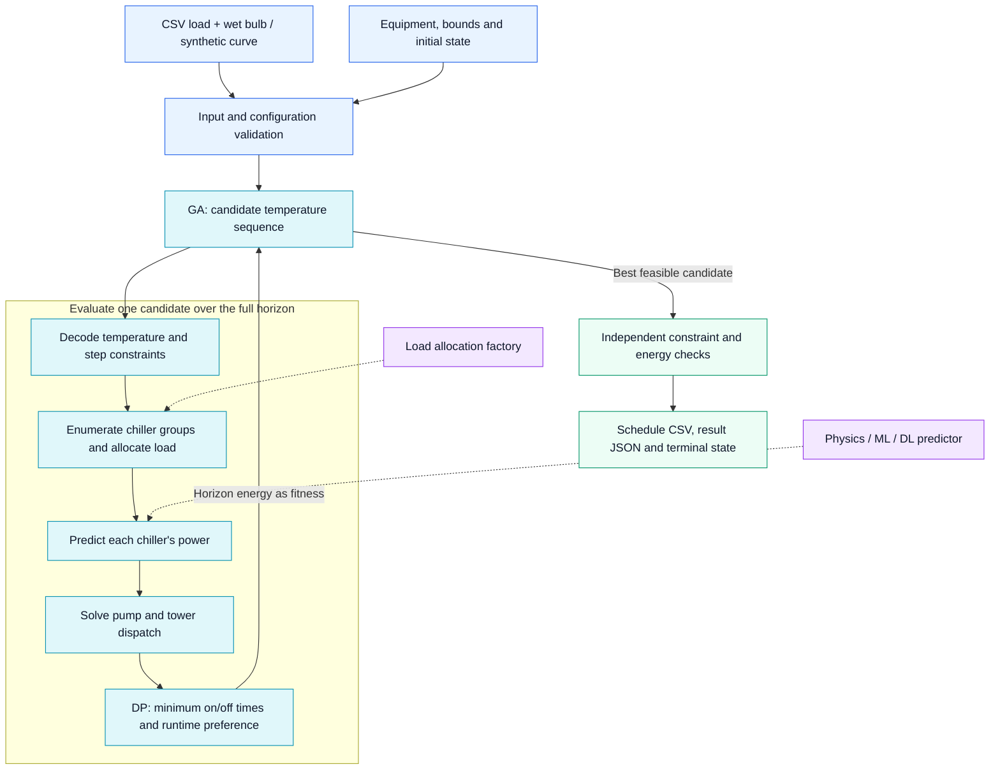

# 冷站负荷与控制策略优化

**简体中文** · [English](README_EN.md)

**Python 3.10+ · MIT · 遗传算法 + 动态规划 · 可替换设备模型**

[快速开始](#快速运行) · [系统架构](#系统架构) · [模型接入](docs/MODEL_GUIDE.md) · [主机调度](docs/CHILLER_SCHEDULING.md)

一个可直接运行的冷站控制优化示例：输入负荷、湿球温度和设备配置，用**遗传算法（GA）**搜索整个计划时段的低电耗控制策略，输出主机启停、负荷分配、泵塔频率和温度设定值。

**公开版本的设备规格、性能曲线和校准参数全部为虚构示例。** 默认主机在 **65% 负载率**附近 COP 最高；泵和塔风机使用相似定律；冷却塔使用虚构的归一化 Merkel-NTU 简化模型。只需 Python 3.10+，无第三方运行依赖、数据库或天气服务。

## 项目能力

| 从什么开始 | 框架负责什么 | 得到什么 |
| --- | --- | --- |
| CSV 负荷与湿球曲线，或随机生成样例 | GA 搜索整段温度序列，检查温度/温差/逼近度边界 | 分时段水温设定值与总电耗 |
| 设备容量、初始启停状态和运行小时 | 动态规划满足至少开机 2h、停机 2h，同能耗下优先较短运行时数 | 主机启停路径与可继承的计划末态 |
| 自有公式、机器学习或深度学习预测器 | 标准化模型接口、可替换的冷量分配和泵塔组合计算 | 单机负荷、PLR、泵塔频率和功率明细 |

适合学习冷站优化、验证自有设备模型以及开发离线控制策略。输出是搜索到的最佳可行方案；banner 中的“全局优化”表示整站、整段联合寻优，不代表数学上的全局最优保证。

## 系统架构



**外层 GA 调温度，内层动态规划选启停路径。** 每条候选温度序列先得到各时段、各主机组合的功率，再由动态规划处理跨时段开停约束，整段电耗返回 GA 作为适应度。虚线表示可替换的模型接口；同一模型同时用于计算与最终复核。

| 模块 | 职责 |
| --- | --- |
| `main.py` / `config.py` / `load_generate.py` | 命令行入口、输入校验、配置与负荷加载 |
| `ga_series.py` / `optimize_utils.py` | 全时域搜索、温度解码、设备组合评估与结果复核 |
| `model_interface.py` / `load_allocation.py` | 可替换的单机功率预测与组合内负荷分配 |
| `power_models.py` / `pump_lookup.py` | 默认虚构模型、泵组合预计算与泵塔功率计算 |
| `chiller_scheduling.py` | 带最小开停时间的动态规划、运行小时优先级及状态回放 |

## 快速运行

已有自己的模型？先看 [模型接入指南](docs/MODEL_GUIDE.md)：包含可直接运行的机理模型，以及机器学习、深度学习适配示例，说明输入输出、单位、预处理、有效工况范围和泵塔扩展位置。主机支持按设备配置自定义预测器，无需修改遗传算法。

在项目目录运行：

```bash
python main.py
```

默认生成可复现的 24 小时负荷并优化。也可导入自备文件：

```bash
python main.py --load examples/load.csv --output outputs/my_plan
python main.py --config config/default.json --load examples/load.csv --output outputs/custom
```

指定各台主机的历史累计运行小时数（按配置中 `chillers` 的顺序）：

```bash
python main.py --runtime-hours 1200 800 450 1000 --output outputs/runtime_plan
```

默认最小连续开机、停机时间均为 **2 小时**；能耗相同时优先使用累计运行时间较短的主机。详见 [主机启停与负荷分配](docs/CHILLER_SCHEDULING.md)。

生成独立负荷文件，编辑后重新导入：

```bash
python main.py --generate-only inputs/my_load.csv
python main.py --load inputs/my_load.csv --output outputs/imported
```

`--generate-only` 不覆盖已存在的文件。`--output` 目录中的同名结果会被更新；为保留多次实验，请使用不同目录。`python main.py --help` 查看全部选项。上传或收到的负荷文件保存为下述 CSV 后，通过 `--load` 导入；本版本提供命令行入口，不含网页上传界面。

## 负荷文件格式

UTF-8 CSV，必须且只能包含以下四列（列顺序可变，支持 UTF-8 BOM）：

```csv
timestamp,load_kw,wet_bulb_c,duration_hours
2026-07-01T08:00:00,1800,23.5,1
2026-07-01T09:00:00,2200,24,1
2026-07-01T10:00:00,2500,24.5,1
```

| 列 | 含义与要求 |
| --- | --- |
| `timestamp` | 时段开始时间，ISO 8601；所有行统一使用无时区时间或带时区时间 |
| `load_kw` | 时段平均供冷负荷，kW；非负，0 表示停机 |
| `wet_bulb_c` | 时段室外湿球温度，°C；必须提供，用于计算逼近度 |
| `duration_hours` | 时段持续小时数；正数，15 分钟填 `0.25` |

行必须按时间连续排列，后一行开始时间等于前一行开始时间加持续时间。不自动填补缺失时段、不忽略负荷、不截断超容量值。空文件、重复时间、缺列、NaN、负负荷会给出错误。支持任意非空时段数，电耗按 `功率 × duration_hours` 累加，不把 kW 之和误称为 kWh。

`examples/load.csv` 是含停机、启动、峰值负荷和停机段的完整虚构日样例。随机负荷由 `load_generation` 配置控制：开始时间、时段数、间隔、总装机容量的负荷比例上下限、每步最大负荷变化（占总可用容量的比例）、湿球范围和种子。它是样例生成器，不是预测模型。

## 配置设备与寻优范围

完整初始数据位于 [`config/default.json`](config/default.json)。设备数组长度就是台数，支持每组 1–8 台，增减设备无需改代码。组合枚举适合小型教学项目，设备多时计算量会增加。

| 配置项 | 可配置内容 |
| --- | --- |
| `chillers` | 每台主机 ID、额定冷量 `capacity_kw`、最小/最大负载率、COP 倍率 |
| `chiller_model` | 全局主机 COP 峰值、峰值负载率、曲率、参考水温、温升敏感度、COP 下限 |
| `chillers[i].model` | 可选，只覆盖这一台主机的任意上述模型字段 |
| `chillers[i].predictor` | 可选，自定义功率模型工厂、加载选项和有效工况域；优先于内置 COP 模型 |
| `load_allocation` | 自定义组合内负荷分配工厂；默认 `null` 表示按额定冷量比例分配 |
| `chiller_scheduling` | 最小开停机时间、初始启停状态、状态持续小时、累计运行小时及优先规则 |
| `chw_pumps` / `cw_pumps` | 每台泵的 ID、额定流量 m³/h、功率 kW、扬程 m、频率 Hz、转速比上下限 |
| `towers` | 每座塔的 ID、虚构散热容量 kW、额定风机功率和频率、转速比上下限 |
| `tower_model` | 全开逼近度、最大逼近度、空气量指数 |
| `water_heat_capacity_kwh_m3_k` | 水的体积热容换算系数，默认 1.163 kWh/(m³·K) |
| `optimization` | 寻优边界、变化限制、前一时段水温、GA 参数和随机种子 |
| `load_generation` | 随机负荷及湿球温度生成设置 |

例如在某台主机配置中增加 `"model": {"peak_cop": 7.0, "peak_plr": 0.62}`，即可覆盖其曲线；其余字段继承全局模型。`cop_multiplier` 再乘到该台主机的曲线上。字段名拼错会被拒绝。

更换整个模型而非系数时使用 `predictor`。它返回最终单机功率，不再应用内置曲线和 `cop_multiplier`。例如运行 `python -m examples.use_custom_model`，可体验自定义机理模型的完整优化流程。详见 [接入配置和接口约定](docs/MODEL_GUIDE.md)。默认模式无需额外依赖；可选 ML/DL 适配器由用户在自己的环境中安装对应依赖并提供权重。

`optimization.bounds` 的温度单位均为 °C，温差/逼近度数值单位为 K：

| 字段 | 含义 | 默认范围 |
| --- | --- | --- |
| `chw_supply_c` | 冷冻供水温度，即主机出水温度 | 6–12 |
| `chw_delta_c` | 冷冻回水 − 冷冻供水 | 3–6 |
| `cw_delta_c` | 冷却回水 − 冷却供水 | 3–6 |
| `cw_supply_c` | 冷却供水温度，即出塔/进冷凝器温度 | 20–36 |
| `chw_return_c` | 冷冻回水温度 | 9–18 |
| `cw_return_c` | 冷却回水温度，即出冷凝器/进塔温度 | 23–42 |
| `approach_c` | 出塔温度 − 室外湿球温度 | 3–8 |

**相邻时段变化限制：**

- `max_temperature_step_c: 1.5` 同时约束冷冻供水、冷冻回水、冷却供水、冷却回水四个水温。
- `max_control_step_c: 1.5` 同时约束两个供水温度和两侧温差，即四个 GA 控制变量。
- `initial_temperatures` 是第一时段之前的四个水温，默认提供虚构初值；第一时段也必须满足相对初值的变化限制。确实没有历史初值时可填 `null`，仅取消首时段与历史值的比较。
- 限制按“相邻时段”应用，不按小时缩放。15 分钟输入默认仍是每步 1.5°C；需要更平缓时请调小。
- 零负荷时所有设备关闭、功率和流量为 0，但保留连续的温度设定值，避免人为把温度置零造成恢复运行时跳变。停机段温度是计划设定值，不是停机后的实际水温预测。

逼近度边界必须位于 `tower_model` 的全开逼近度与最大逼近度之间。如果湿球、初值或温度边界冲突，程序不会通过放宽限制交付结果。

## 模型与算法

### 虚构主机 COP

```text
PLR = 单机负荷 / 单机额定冷量
lift_offset = (冷却回水 - 冷冻供水) - (参考冷却回水 - 参考冷冻供水)
COP = peak_cop × cop_multiplier / [1 + curvature × (PLR - peak_plr)²]
      × exp(-lift_sensitivity × lift_offset)
P_chiller = load / max(minimum_cop, COP)
```

默认参考工况：冷冻供水 8°C、冷却回水 34°C，`peak_cop=6.5`、`peak_plr=0.65`。保持水温不变时 COP 在 65% 负载率达到峰值。公开文件不包含旧主机拟合参数、设备型号、拟合指标或实测曲线。

每个候选控制点枚举主机组合，默认按额定冷量比例分配冷量，因此运行主机具有**相同 PLR**。可通过 `load_allocation` 替换此规则，使各机 PLR 不同；无论采用哪种分配，都检查冷量守恒和每台 PLR 范围，再计算主机、泵、塔总功率。GA 本身不额外搜索独立的单机冷量，分配方案由所配置的分配函数决定。

各时段的组合交给动态规划，在整段负荷曲线上选择满足最小开停机时间的最低电耗路径。它会保留当前稍贵但能满足后续负荷的方案，避免逐时独立选机造成后续无可用设备。

### 泵和风机相似定律

```text
r = frequency / rated_frequency
flow = rated_flow × r
head = rated_head × r²
power = rated_power × r³
```

泵采用理想并联、运行泵共用转速比的简化形式，枚举启停组合后反算精确满足所需流量的转速。低于最小转速或超过最大转速的组合不可行。程序不通过多送水来伪造目标温差，不求解实际管网阻力或异构泵并联的压力平衡；扬程是相似定律下的输出值。

```text
冷冻流量 = 负荷 / (水体积热容 × 冷冻温差)
冷却散热量 = 负荷 + 主机功率
冷却流量 = 冷却散热量 / (水体积热容 × 冷却温差)
```

辅助设备电功率计入总电耗；这里的热平衡不包含泵向水侧的传热。

泵组合在内存中预计算，运行不依赖外部查表文件。需要查看离散流量样本时可导出：

```bash
python create_pump_tables.py --config config/default.json --output outputs/pump_tables
```

导出表中不可行流量明确标记为 `False`。优化器始终读取当前配置直接求解，不复用旧参数生成的磁盘缓存。

### 虚构 Merkel-NTU 塔模型

采用 Merkel/NTU 思路的**归一化教学近似**，并非严格的湿空气焓积分或现场校准模型。概念参考 [EnergyPlus 冷却塔工程文档](https://bigladdersoftware.com/epx/docs/25-2/engineering-reference/cooling-towers-and-evaporative-fluid-coolers.html)。所有容量和指数均为虚构，公式为本项目简化定义：

```text
R = 冷却水温差
u = Σ(运行塔额定散热容量 × 转速比) / 全部塔额定散热容量
NTU_full = ln(1 + R / full_speed_approach)
NTU = NTU_full × u^air_exponent
approach = R / [exp(NTU) - 1]
```

该模型在每个水温差下归一化：全部塔均以额定转速运行时 `u=1`，逼近度恰为默认的 **3°C**；减塔或降速后逼近度增大，寻优最大允许 **8°C**。散热需求还必须不超过运行塔的虚构额定散热容量之和。转速通过目标逼近度反算，风机功率按三次方计算。

散热容量在这里是独立的上限，不是随湿球、流量、风量完整变化的热工性能曲线。该归一化做法刻意满足示例的 3–8°C 需求，实际项目可替换 `power_models.py` 和塔调度函数。

### 遗传算法

每条染色体代表整个时域的 `时段数 × 4` 个连续控制变量。算法采用锦标赛选择、实数混合交叉、高斯变异和精英保留；每一代比较**全时段总电耗**。解码时同时收紧温度、温差、逼近度和相邻步长范围，并对后续湿球变化做供水温度区间回传。设备能力不满足的个体直接判不可行。

默认参数：种群 32、迭代 35、精英 2、锦标赛 3、交叉率 0.85、变异率 0.12、归一化变异幅度 0.15、种子 42；均在配置里修改。

输出是 **GA 找到并验证的最佳可行策略**，不承诺数学上的全局最优。没有找到可行解时返回退出码 2 和错误原因，不输出新的结果；此时也不等于证明问题无解。可以检查设备容量、最小流量、初始水温及边界，或增加种群与迭代数。精英保留保证已找到的最佳可行目标值不变差。

默认最小开机和停机时间均为 2 小时，按 `duration_hours` 累加；主机切换只发生在输入时段边界。累计运行小时可用于电耗相同时的优先选择，并随规划时段更新。默认要求到计划末尾已满足本次最小开/停时长；短计划或滚动规划可显式选择 `carry_over` 并将输出末态传入下一次规划，不能直接丢弃未完成的锁定时间。详见 [配置与边界行为](docs/CHILLER_SCHEDULING.md)。

当前仍不包含启停成本、泵塔最小开停机时间、频率变化上限或现场联锁。结果仅供离线算法演示，不直接下发控制指令。

## 结果文件

| 文件 | 内容 |
| --- | --- |
| `schedule.csv` | 每个时段的负荷、水温、两侧流量、设备动作、各项功率和电耗；设备列表为 JSON 单元格 |
| `result.json` | 完整结构化结果、GA 最佳值历史、初始种群最佳值、随机种子及 `terminal_chiller_state` 末态 |
| `convergence.csv` | 每一代最佳可行电耗；尚无可行解时为空值 |
| `load.csv` | 本次实际使用的输入负荷 |
| `config.json` | 本次实际使用的完整配置快照 |

设备动作列表明确给出运行设备 ID；未出现在对应列表中的设备为关闭状态。主机列表包含负荷、PLR、COP 和功率；泵/塔包含转速比及 Hz，泵另含扬程。四项设备功率之和是 `total_power_kw`，`energy_kwh` 是该时段电耗。

每行还包含 `chiller_on`、`chiller_runtime_hours`、`chiller_state_hours`、`chiller_remaining_lock_hours` 数组，均按配置设备顺序排列，数值为该时段结束时的状态。导出前会独立回放并验证最小开停机时长、累计运行小时及自定义分配结果。

导出前独立复核：输入时段、各项边界、首时段初值、相邻四个水温和四个控制变量、设备转速/PLR、供冷和两侧热平衡、Merkel 逼近度、总功率与电耗。`initial_population_best_energy_kwh` 是算法初始种群最佳值，不代表真实现场基线或节能率。

## 项目结构与开发

```text
config/default.json       完整虚构设备与算法配置
README_EN.md             English documentation
docs/assets/banner.png   README 顶部项目图片
config.py                 配置读取与校验
main.py                   CSV/随机负荷入口与结果导出
ga_series.py              全时域遗传算法
optimize_utils.py         控制序列解码、设备调度、结果复核
power_models.py           虚构模型和相似定律
model_interface.py        自定义主机功率接口及有效域校验
load_allocation.py        可替换的组合内负荷分配接口
chiller_scheduling.py     最小开停机约束与运行小时优先选择
examples/load_allocators.py  自定义不同 PLR 分配示例
docs/CHILLER_SCHEDULING.md  主机调度、输入数组与滚动规划说明
examples/model_adapters.py  机理、sklearn、PyTorch 适配示例
examples/use_custom_model.py  自定义机理模型完整演示
docs/MODEL_GUIDE.md       模型替换与扩展指南
pump_lookup.py            泵组合预计算与精确流量求解
create_pump_tables.py     可选泵表导出
load_generate.py          CSV 格式校验及随机负荷
examples/load.csv         完整公开样例
tests/test_planner.py     模型、约束、负荷与端到端测试
build_release.py          按明确文件清单打包公开源码
.github/workflows/tests.yml  GitHub Actions
```

运行测试（不安装依赖）：

```bash
python -m unittest discover -s tests -v
```

测试覆盖 COP 峰值、泵/风机相似定律、塔 3–8°C 端点、模型覆盖、配置校验、负荷导入、零负荷、非整小时电耗、可复现 GA、变化约束、不可行输入和文件导出。CI 配置在 Python 3.10–3.13 上执行测试及完整 CSV 样例。

欢迎提交可复现问题和小范围改进，见 [CONTRIBUTING.md](CONTRIBUTING.md)。许可证为 [MIT](LICENSE)。
