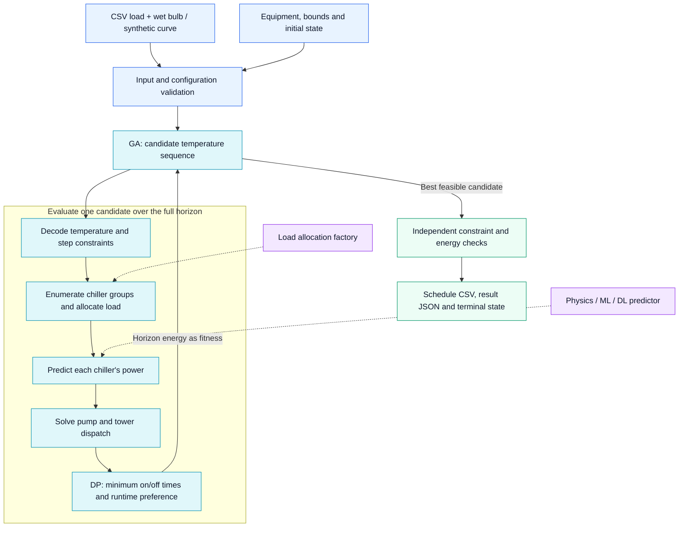

# Chiller Plant Optimization

[简体中文](README.md) · **English**

**Python 3.10+ · MIT · Genetic Algorithm + Dynamic Programming · Custom Equipment Models**

[Quick start](#quick-start) · [Architecture](#architecture) · [Configuration](#configuration) · [Custom models](#custom-equipment-models) · [Unit commitment](#unit-commitment-and-runtime-preference)

An offline optimization framework that turns a cooling-load curve, wet-bulb temperatures, and equipment models into an energy-efficient operating schedule. It outputs chiller commitment, individual cooling loads, pump and tower speeds, water-temperature setpoints, and energy consumption.

**All bundled equipment specifications and model coefficients are fictional.** The default chiller reaches peak COP at 65% part load; pumps and tower fans use affinity laws, and the tower uses a normalized Merkel-NTU approximation. The default application requires only the Python standard library. It does not depend on a database, weather service, or live plant connection.

## What the framework does

| Bring your own | The framework handles | Outputs |
| --- | --- | --- |
| Load and wet-bulb CSV, or synthetic example data | Whole-horizon temperature search with operating bounds | Temperature setpoints and total energy |
| Equipment capacities, initial states, and operating hours | Minimum 2-hour on/off times and runtime preference among equal-energy paths | Chiller commitment and continuation state |
| Physics-based, machine-learning, or deep-learning predictors | Model adapters, replaceable load allocation, and pump/tower dispatch | Individual loads, PLRs, speeds, and power breakdowns |

Use it to learn plant optimization, evaluate your own equipment models, or develop offline control strategies. Results are the best feasible schedules found by the search. “Global optimization” in the supplied banner refers to plant-wide, whole-horizon optimization; it is not a guarantee of the mathematical global optimum.

## Architecture



**The outer GA searches temperature sequences; the inner dynamic program selects commitment paths.** Each candidate produces feasible equipment combinations and their power consumption for every period. The dynamic program applies inter-period on/off constraints and returns horizon energy as fitness. Dotted arrows mark replaceable model interfaces. The selected schedule is checked again before export.

| Module | Responsibility |
| --- | --- |
| `main.py`, `config.py`, `load_generate.py` | CLI, configuration validation, CSV loading, and synthetic inputs |
| `ga_series.py`, `optimize_utils.py` | Sequence search, temperature decoding, equipment evaluation, and final checks |
| `model_interface.py`, `load_allocation.py` | Custom power predictors and cooling-load allocation |
| `power_models.py`, `pump_lookup.py` | Fictional defaults, pump subset precomputation, and auxiliary equipment calculations |
| `chiller_scheduling.py` | Minimum up/down time constraints, runtime preference, and state replay |

## Quick start

Run these commands from the project root with Python 3.10 or newer. No package installation is required for the default models.

```bash
# Generate a reproducible 24-hour load curve and optimize it.
python main.py

# Use the bundled CSV or a file of your own.
python main.py --load examples/load.csv --output outputs/my_plan

# Select a complete plant configuration.
python main.py --config config/default.json --load examples/load.csv --output outputs/custom

# Supply historical chiller operating hours, in configuration order.
python main.py --runtime-hours 1200 800 450 1000 --output outputs/runtime_plan
```

Generate a load file to inspect or edit, then import it:

```bash
python main.py --generate-only inputs/my_load.csv
python main.py --load inputs/my_load.csv --output outputs/imported
```

`--generate-only` refuses to overwrite an existing file. Planning updates files with the same names in the output directory, so use separate directories to retain experiments. Run `python main.py --help` for options. This is a CLI application; save uploaded or received data as a CSV before passing it to `--load`.

## Load CSV format

Use UTF-8 CSV with exactly these four columns. Column order may vary; a UTF-8 BOM is accepted.

```csv
timestamp,load_kw,wet_bulb_c,duration_hours
2026-07-01T08:00:00,1800,23.5,1
2026-07-01T09:00:00,2200,24,1
2026-07-01T10:00:00,2500,24.5,1
```

| Column | Meaning |
| --- | --- |
| `timestamp` | Period start in ISO 8601 format; consistently timezone-aware or timezone-naive |
| `load_kw` | Average cooling demand during the period, in kW; nonnegative, with zero meaning shutdown |
| `wet_bulb_c` | Outdoor wet-bulb temperature in °C, required to determine tower approach |
| `duration_hours` | Positive period length in hours; use `0.25` for 15 minutes |

Periods must be ordered and contiguous: each start must equal the previous start plus its duration. Empty inputs, missing columns, duplicate times, nonfinite values, and negative loads are rejected. The planner does not silently fill gaps, discard demand, or clamp excessive loads.

Energy is calculated as `sum(power_kw * duration_hours)`. Arbitrary nonempty horizons are accepted as input, but a feasible plan must also satisfy initial-state and terminal on/off constraints. A short horizon may therefore require explicit continuation handling.

The bundled [load example](examples/load.csv) includes shutdown, startup, peak demand, and shutdown periods. `load_generation` controls start time, period count and spacing, load fractions of available capacity, maximum load change per step as a fraction of that capacity, wet-bulb range, and seed. It generates synthetic examples rather than forecasting real demand.

## Configuration

[config/default.json](config/default.json) contains a complete fictional plant. Each equipment array supports 1–8 devices; array length determines the device count. Keep state/runtime arrays aligned when changing chiller order or count. Enumeration and commitment state growth make this implementation most suitable for small plants.

| Setting | Configurable data |
| --- | --- |
| `chillers` | IDs, rated cooling capacity, minimum/maximum PLR, and COP multiplier |
| `chiller_model` | Peak COP and PLR, curve shape, reference temperatures, lift sensitivity, and minimum COP |
| `chillers[i].model` | Optional overrides of the built-in model for one chiller |
| `chillers[i].predictor` | Optional custom power factory, loading options, and valid operating domain |
| `load_allocation` | Optional allocation factory; `null` selects capacity-proportional allocation |
| `chiller_scheduling` | Minimum up/down times, initial state, state duration, runtime hours, and terminal policy |
| `chw_pumps`, `cw_pumps` | Rated flow, power, head, frequency, and speed-ratio limits for each pump |
| `towers`, `tower_model` | Rated rejection capacity, fan power/frequency, speed limits, and fictional thermal parameters |
| `water_heat_capacity_kwh_m3_k` | Volumetric water heat-capacity conversion, default 1.163 kWh/(m³·K) |
| `optimization` | Operating bounds, step limits, initial temperatures, GA parameters, and seed |
| `load_generation` | Synthetic input settings |

### Temperature bounds

Temperatures are in °C. Temperature differences and approach have the same numerical values in K.

| Field | Definition | Default range |
| --- | --- | --- |
| `chw_supply_c` | Chilled-water supply / chiller outlet | 6–12 |
| `chw_delta_c` | Chilled-water return minus supply | 3–6 |
| `cw_delta_c` | Cooling-water return minus supply | 3–6 |
| `cw_supply_c` | Cooling-water supply / tower outlet / condenser inlet | 20–36 |
| `chw_return_c` | Chilled-water return / chiller inlet | 9–18 |
| `cw_return_c` | Cooling-water return / condenser outlet / tower inlet | 23–42 |
| `approach_c` | Tower outlet minus outdoor wet bulb | 3–8 |

`max_temperature_step_c: 1.5` limits changes in all four supply/return temperatures. `max_control_step_c: 1.5` also limits the four GA variables: the two supply temperatures and two water-temperature differences. Limits apply per adjacent period, without hourly rescaling.

`initial_temperatures` supplies the preceding four temperatures, so the first period is constrained too. Set it to `null` only when no previous setpoints are available. During zero load, equipment power and flow are zero while setpoints remain continuous; these are planned setpoints, not predictions of idle water temperatures. Approach bounds must remain within the tower model's configured limits.

## Unit commitment and runtime preference

Both minimum on-time and minimum off-time default to **2 hours**, accumulated from actual period durations. Switching occurs only at period boundaries: a 15-minute schedule needs eight complete periods to satisfy a new 2-hour commitment.

Example top-level configuration fragment:

```json
{
  "chiller_scheduling": {
    "min_on_hours": 2,
    "min_off_hours": 2,
    "initial_on": [false, false, false, false],
    "initial_state_hours": [5, 3, 2, 4],
    "runtime_hours": [1200, 800, 450, 1000],
    "prefer_shorter_runtime": true,
    "terminal_policy": "require_complete"
  }
}
```

`initial_state_hours` means continuous time already spent in the current on/off state. `runtime_hours` means historical cumulative **on** hours. They are different quantities. Arrays follow `chillers` order. Default `null` values assume all chillers are off and eligible to switch; unknown runtime defaults to zero for off units and the known continuous on-time for running units. Supply actual values for your plant.

The priority is **hard feasibility, then minimum energy, then runtime preference among equal-energy paths**. Planned on-hours are accumulated. A shorter-runtime preference uses the incremental sum of squared operating hours to favor less-used machines and distribute additional hours. It does not override a more efficient unit when energy differs. Runtime balancing is a tie-breaking heuristic, not a guarantee of globally optimal wear balancing across all equal-energy paths.

With `require_complete`, no minimum on/off duration may remain unfinished at the end of the horizon. A chiller cannot start in the last one-hour period if it needs two hours. The horizon end itself does not shut equipment down.

For rolling horizons, explicitly select `carry_over`. Copy `initial_on`, `initial_state_hours`, and `runtime_hours` from `result["terminal_chiller_state"]` into the next configuration, after checking its `chiller_ids` order. Carry the final four water temperatures into `optimization.initial_temperatures` too. Use contiguous horizons and real observed states if operation deviates from the plan. Outstanding `remaining_lock_hours` must be honored in the next plan; the tool does not execute or enforce future controls on its own.

Zero load requires all equipment off. A conflict with an unfinished on-time is infeasible; the planner does not invent storage, bypass operation, or idle cooling. See the detailed [scheduling guide, in Chinese](docs/CHILLER_SCHEDULING.md) for examples and edge cases.

## Custom equipment models

Change built-in curve coefficients through `chiller_model`, or add a device override such as `"model": {"peak_cop": 7.0, "peak_plr": 0.62}`. To replace the model entirely, configure a per-chiller `predictor`. Physics equations, regressors, and neural networks share the same pointwise power interface; the GA does not require derivatives.

Run the complete fictional physics-based adapter example:

```bash
python -m examples.use_custom_model
```

The following is a `predictor` fragment to add inside a chiller configuration:

```json
{
  "factory": "examples.model_adapters:create_mechanistic",
  "options": {"efficiency": 0.6},
  "domain": {"plr": [0.15, 1.0], "chw_supply_c": [6, 12], "cw_return_c": [23, 42]}
}
```

`factory` is an importable `module.path:function_name`. The factory receives an options dictionary and returns a callable taking an immutable `ChillerInputs` object. It has the individual `load_kw`, `capacity_kw`, derived `plr`, all four water temperatures, and `wet_bulb_c`. Return a finite, positive scalar **power in kW**. If your model predicts COP, convert it to `load_kw / COP`; restore original units if it predicts normalized power or watts.

The factory loads once per device per planning run, and the predictor is reused during search and final checks. A custom predictor supplies final power, so built-in COP coefficients and `cop_multiplier` are not applied again. Devices without a predictor continue using the default model. Keep the existing built-in fields in the complete configuration for schema compatibility.

Declare a validated `domain` containing at least PLR, chilled-water supply, and cooling-water return bounds. Out-of-domain candidates are rejected. Use `ModelDomainError` for additional known domain restrictions; invalid predictions and implementation errors stop planning rather than being treated as low power. Avoid uncontrolled extrapolation: optimization can exploit errors in sparsely observed operating regions.

| Bundled adapter | Purpose | Additional requirements |
| --- | --- | --- |
| `create_mechanistic` | Fictional Carnot-based power equation | None |
| `create_sklearn` | A fitted, single-output Pipeline predicting raw power kW | Compatible numpy, scikit-learn, joblib, and a trusted artifact |
| `create_torch` | CPU inference for the example 3→16→1 MLP | PyTorch, matching state-dict weights, and training mean/scale |

The ML/DL examples use feature order `[load_kw, chw_supply_c, cw_return_c]`. Preserve training feature order, input/output units, preprocessing, architecture, and inference mode. Artifact paths are relative to the working directory unless absolute. Optional dependencies and trained weights are not bundled or installed automatically. TensorFlow, ONNX, or other predictors can use the same interface, but their adapters are not included.

The current interface is stateless and pointwise. Stateful models need explicit, independent history/state propagation for each candidate in `Plant.evaluate`; do not mutate shared recurrent state during arbitrary GA evaluations. If a model requires cooling-water flow, account for its coupling to chiller power rather than substituting an unrelated historical flow. Pump/tower replacement requires changing both dispatch and matching validation logic; their models do not yet use the same configurable predictor factory.

See [model adapters](examples/model_adapters.py), [the interface](model_interface.py), and the detailed [model guide, in Chinese](docs/MODEL_GUIDE.md), which includes training/export examples and pump/tower extension points.

### Custom cooling-load allocation

By default, selected chillers share demand in proportion to rated capacity:

```text
individual_load = plant_load × individual_rated_capacity / selected_total_capacity
PLR = individual_load / individual_rated_capacity
```

Thus a 1000 kW and a 2000 kW chiller sharing 1500 kW receive 500 and 1000 kW, both at 50% PLR. The default does not optimize independent individual PLRs.

Replace this policy with a top-level allocation factory:

```json
{
  "load_allocation": {
    "factory": "examples.load_allocators:create_priority_allocator",
    "options": {"priority_ids": ["CH-2", "CH-1", "CH-3", "CH-4"]}
  }
}
```

The example reserves each selected chiller's minimum output, then fills preferred units up to their maximum PLR. A factory returns a callable taking `AllocationInputs`: total demand, selected equipment IDs/capacities/PLR limits, water temperatures, and wet bulb. Return exactly a mapping of selected **device ID to cooling load in kW**. Convert PLR outputs using rated capacity.

The interface checks device keys, finite nonnegative values, total-load balance, and individual PLRs. Raise `AllocationInfeasible` for an unsupported combination. The allocator is loaded once and reused in final validation. It must be deterministic and independent of mutable schedule history. See [the example allocator](examples/load_allocators.py).

## Default models and search

The fictional chiller curve uses:

```text
lift_offset = (cw_return - chw_supply) - (reference_cw_return - reference_chw_supply)
COP = peak_cop × cop_multiplier / [1 + curvature × (PLR - peak_plr)²]
      × exp(-lift_sensitivity × lift_offset)
power = load / max(minimum_cop, COP)
```

Default reference conditions are 8°C chilled-water supply and 34°C cooling-water return, with peak COP 6.5 at PLR 0.65. These values are synthetic, not measured performance.

Pumps use `flow = rated_flow × r`, `head = rated_head × r²`, and `power = rated_power × r³`, where `r` is the speed ratio. Selected pumps operate at a common speed ratio in an ideal parallel bank. The solver meets the required flow exactly, rejecting combinations outside speed limits. It does not solve hydraulic pressure balance for heterogeneous pumps or a real pipe network.

```text
chw_flow = cooling_load / (water_heat_capacity × chw_delta)
heat_rejection = cooling_load + chiller_power
cw_flow = heat_rejection / (water_heat_capacity × cw_delta)
```

Auxiliary electrical power is included in total energy, but pump heat entering the water is omitted from these heat balances. Pump subsets are precomputed in memory; no old disk lookup data is reused. Optional sample-table export:

```bash
python create_pump_tables.py --config config/default.json --output outputs/pump_tables
```

The tower uses a fictional normalized Merkel-NTU relation:

```text
R = cooling-water temperature difference
u = sum(active_tower_rated_capacity × speed_ratio) / total_tower_rated_capacity
NTU_full = ln(1 + R / full_speed_approach)
NTU = NTU_full × u^air_exponent
approach = R / [exp(NTU) - 1]
```

All towers at rated speed give exactly the configured 3°C approach by construction; reducing effort increases approach, up to the default allowable 8°C. Heat rejection must also fit the selected towers' rated capacity sum. Fan power follows the cubic affinity law. This is a teaching approximation, not a calibrated moist-air enthalpy integral; the capacity cap is independent of a full off-design thermal performance curve. The conceptual reference is the [EnergyPlus cooling-tower engineering documentation](https://bigladdersoftware.com/epx/docs/25-2/engineering-reference/cooling-towers-and-evaporative-fluid-coolers.html).

Each GA chromosome has `periods × 4` continuous control genes. Tournament selection, blended crossover, Gaussian mutation, and elitism search horizon energy. Defaults are population 32, generations 35, elites 2, tournament size 3, crossover rate 0.85, mutation rate 0.12, mutation scale 0.15, and seed 42.

For fixed candidate temperatures and allocation, dynamic programming chooses a minimum-energy feasible commitment path within numerical tolerances. The outer search remains heuristic. Failure to find a schedule returns exit code 2 and does not export a new result; it is not a proof that no feasible solution exists. Check load/capacity, minimum output and flow, domains, initial states, bounds, and horizon policy before increasing search effort.

## Outputs

| File | Contents |
| --- | --- |
| `schedule.csv` | Per-period inputs, setpoints, flows, equipment actions, component power, and energy; equipment lists are JSON cells |
| `result.json` | Full schedule, GA history, initial-population best energy, seed, status, and terminal chiller state |
| `convergence.csv` | Best feasible energy by generation; blank when no feasible candidate exists yet |
| `load.csv` | The input actually used |
| `config.json` | The complete configuration used, including CLI runtime overrides |

Equipment omitted from an active-device list is off. Chillers include load, PLR, COP, and power; pumps/towers include speed ratio and Hz, with pump head also reported. `total_power_kw` sums all component powers; `energy_kwh` multiplies by period duration.

The `chiller_on`, `chiller_runtime_hours`, `chiller_state_hours`, and `chiller_remaining_lock_hours` arrays describe the **end of each period**, in configured chiller order. `terminal_chiller_state` also includes explicit IDs for continuation.

Before export, independent checks replay commitment and runtime accounting and verify input consistency, bounds, initial/adjacent temperatures, load allocation, PLR/speed limits, cooling and heat balances, tower approach, component power, and energy. The initial-population best is an algorithm starting point, not a real operating baseline or measured energy saving.

## Development and scope

```bash
python -m unittest discover -s tests -v

# Focused unit-commitment and allocation tests
python -m unittest discover -s tests -p test_chiller_scheduling.py -v

# Custom-model tests; optional framework tests skip when dependencies are absent
python -m unittest discover -s tests -p test_model_interface.py -v
```

The CI configuration runs tests and the CSV example on Python 3.10–3.13. Coverage includes model behavior, input validation, zero load, irregular intervals, reproducibility, thermal constraints, minimum up/down times, runtime preference, continuation, custom allocation, and comparison with exhaustive small commitment cases.

The current planner does not include startup energy/costs, equipment faults, minimum pump/tower up/down times, frequency slew limits, storage, or plant safety interlocks. It produces offline plans and does not send commands to real equipment.

Keep private weights in `models/`, adapters in `local_models/`, site configuration in `config/local*.json`, and real inputs in `inputs/`. These paths and generated `outputs/` are ignored by Git. Share public source through the explicit archive manifest:

```bash
python build_release.py
```

This produces `outputs/forecast_and_plan_simple-source.zip`, including both READMEs and the banner, while excluding local caches, environments, private models, and run outputs.

Contributions are welcome; see [CONTRIBUTING.md, in Chinese](CONTRIBUTING.md). Released under the [MIT License](LICENSE).
